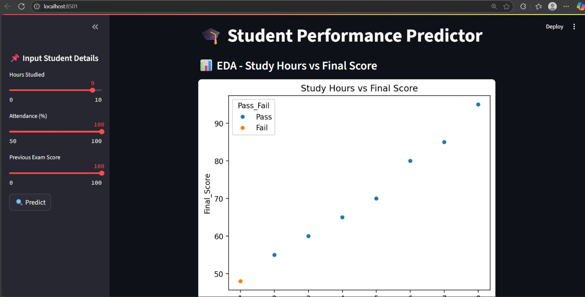

# 🎓 Student Performance Predictor

A Streamlit web application that predicts student final exam scores based on study hours, attendance, and previous exam scores. The app also classifies whether a student is likely to pass or fail.

---

## 🚀 Features

- Predicts final exam score using a trained **Linear Regression** model.
- Classifies pass/fail status with a **Logistic Regression** model.
- Visualizes student data with scatter plots and correlation heatmaps.
- Interactive input sliders for user to enter study hours, attendance %, and previous scores.
- Displays prediction history within the app session.

---

## 🛠️ Tech Stack

- Python 3.x  
- Streamlit  
- Pandas  
- Scikit-learn  
- Matplotlib  
- Seaborn  
- Joblib  

---

## 📊 Demo Screenshot



---

## ⚙️ How to Clone and Use

### 1. Clone the repository

Open your terminal or command prompt and run:

```bash
git clone https://github.com/YOUR_USERNAME/student-performance-predictor.git
cd student-performance-predictor

2. Install dependencies
Make sure you have Python installed, then run:

bash
Copy
Edit
pip install -r requirements.txt
3. Run the Streamlit App
Start the app using:

bash
Copy
Edit
streamlit run app.py
4. Use the App
A browser window will open automatically, or open your browser and go to: http://localhost:8501/.

Use the sidebar sliders to enter:

Hours Studied

Attendance (%)

Previous Exam Score

Click the Predict button to see the predicted final score and pass/fail status.

View prediction history and data visualizations on the main page.


📫 Contact
Feel free to reach out for questions or suggestions!

GitHub: [GitHub: https://github.com/mukundhasuresh]

LinkedIn: [https://www.linkedin.com/in/mukundha-suresh-390309203/]


🔖 License
This project is open source and available under the MIT License.

